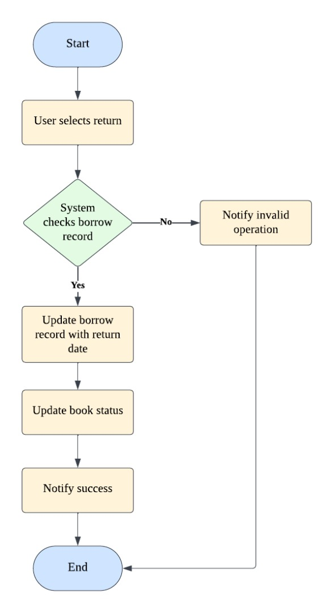

# LIBRARY MANAGEMENT SYSTEM

| NAME  | MATRIC NUMBER |
| ------------- | ------------- |
| SNEHA SEENIVASAN  | B032310779  |
| UGAHNESH A/L MOORTHY  | B032310781  |
| KIRTIGAN A/L BALU  | B032310873  |
| PARTHIBAN A/L SUBRAMANIAM  | B032310789  |
| MADHANAVILASHAN A/L GANAPATHY  | B032310801  |

# Introduction
# Project Overview
The Library Management System (LMS) is a Java-based desktop application that streamlines the management of library operations such as book cataloging, user registration, and borrowing processes. It provides a structured solution to replace traditional manual systems, reducing errors, saving time, and improving record-keeping efficiency. The system supports two main user roles: administrators, who can add or remove books and view the list of registered users, and regular users, who can register, log in, and browse the book collection. Designed for small to medium-sized libraries, academic institutions, or community reading centers, this project offers an intuitive interface and serves as a foundation for potential future enhancements like online book reservations, overdue fine tracking, or integration with external APIs for book data.

# Commercial Value
# Potential Real-World Use
Schools and community libraries can adopt LMS to digitize their daily operations.
Reduces administrative workload by automating inventory and user management.
Can be easily extended to cloud hosting for online access.

# Third-Party Integration Possibilities

# System Architecture

The Library Management System is a Java Swing-based desktop application built using a layered architecture that separates the presentation (UI), business logic, and data access layers. The application supports two main user roles: Admin and User.

- **Presentation Layer:**
  The Java Swing GUI handles all user interactions through multiple forms such as login, registration, user menu, and admin menu.

- **Business Logic Layer:** This layer contains all the logic for system functionality, such as login authentication, book borrowing and returning, and admin actions like adding or removing books.

- **Data Layer:**
  This layer is responsible for all communication with the database. It uses JDBC (Java Database Connectivity) to interact with a MySQL/SQLite database that stores user data, book records, and borrowing history.

- **User Roles**
  - **Admin:** Can log in to manage the library system, including adding/removing books and viewing registered users.
  - **User:** Can register, log in, view available books, and borrow or return them.

# Backend Application
# Technology Stack
| Layer  | Technology |
| ------------- | ------------- |
| Programming  | Eclipse  |
| Server  | Apache (XAMPP)  |
| Database| MySQL (library_db.sql)  |
| Communication  | RESTful API (HTTP, JSON)  |

# API Documentation
# List of Endpoints

| Endpoint  | Method | Description |
| ------------- | ------------- |------------- |
| /register  | POST  | Register a new user  |
| /login  | POST  | Login existing user  |
| /add_book | POST  | Add new book (Admin only) |
| /delete_book  | POST | Delete a book (Admin only) |
| /get_books  | GET | Retrieve all books  |
| /get_book_titles  | GET  | Retrieve all book titles  |
| /get_book_info | POST | Retrieve one book's details  |
| /get_users | RESTful API (HTTP, JSON)  | View all users (Admin)  |
| /borrow_book | POST  | 	Borrow a book |
| /return_book  | POST  | Return a borrowed book  |

# Request & Response Examples
# Register User
- **Request**
{
  "username": "Roy",
  "password": "password123",
  "role": "user"
}

- **Success Response**
{
  "status": "success",
  "message": "User registered successfully"
}

- **Error Response**
{
  "status": "error",
  "message": "Username already exists"
}

- **Borrow Book**
- **Request**
{
  "user_id": 5,
  "book_id": 12
}

- **Success Response**
{
  "status": "success",
  "message": "Book borrowed successfully"
}

- **Error Response**
{
  "status": "error",
  "message": "Book is not available"
}

# Security
1. Current Security:
- **Role-based access control (Admin/User separation)**
- **Plain password storage (To be improved)**

2. Recommended Improvements:
- **Use password_hash() in PHP for password security**
- **Implement JWT tokens for session handling**
- **OAuth 2.0 support for third-party authentication in future versions**

# Frontend Applications
# Admin App
**Purpose:**
 - Manage books and users. Admins can add/remove books and view registered users.

**Technology Stack:**
 - Java Swing (GUI)
 - Apache HttpClient (HTTP requests)
 - Eclipse IDE (Development Environment)

**API Integration:**

| Functionn | Endpoint  | Method | Payload Example | 
| ------------- | ------------- |------------- |------------- |
| Add Book | /api/add_book.php  | POST   | { "title": "Book Title", "author": "Author", "year": 2025 }  |
| Remove Book | /api/delete_book.php  | POST  | { "book_id": 5 }  |
| View Users | /api/get_users.php | GET   | None |

# User App
**Purpose:**
 - Allow users to register, log in, view available books, borrow books, and return books.

**Technology Stack:**
 - Java Swing (GUI)
 - Apache HttpClient (HTTP requests)
 - Eclipse IDE (Development Environment)

**API Integration:**

| Function | Endpoint  | Method | Payload Example | 
| ------------- | ------------- |------------- |------------- |
| View Books  | /api/get_books.php    | GET  | None  |
| Borrow Book | /api/borrow_book.php  | POST  | { "user_id": 1, "book_id": 3 }  |
| Return Book | /api/return_book.php  | POST  | { "user_id": 1, "book_id": 3 } |

# Entity-Relationship Diagram (ERD)
**MySQL**
 - LMS uses MySQL as its relational database system. The SQL file library_db.sql contains all table creation statements and sample data.

- **USERS TABLE**
  Stores user credentials and roles.
  - id: Primary Key
  - username: Unique identifier for each user
  - password: Encrypted password
  - role: Defines whether the user is an admin or a regular user
 
- **BOOKS TABLE**
  Manages book information and borrowing details.
  - id: Primary Key
  - title, author, year: Descriptive book details
  - available: Boolean (1 = available, 0 = borrowed)
  - borrow_date: Date when the book was borrowed
  - return_date: Date when the book was returned
 
- **RELATIONSHIP BY ROLES**
  - **🔒 Users (role = user):**
    - borrows: Users can borrow books
    - views: Users can view available books

  - **🛠️ Admins (role = admin):**
    - adds: Admins can add new books
    - deletes: Admins can remove books
    - views: Admins can view all user activity

# Business Logic and Data Validation
**Use Case Flows**

**Borrow a Book**
    - User selects a book → System checks availability → 
    - If available → Create borrow record → Update book status → Notify success
    - Else → Notify book is unavailable

**Return a Book**
    - User selects return → System checks borrow record →
    - If valid → Update borrow record with return date → Update book status → Notify success
    - Else → Notify invalid operation

**Admin Adds a Book**
    - Admin inputs book details → System validates fields → 
    - Insert book into database → Notify success

**Data Validation**
| Layer  | Validation |
| ------------- | ------------- |
| Frontend  | Non-empty fields, correct data types |
| Backend  | SQL injection prevention, role checks, duplicate username check  |

**Project Setup**
**Frontend (Java Swing via Eclipse)**
 - Open the project in Eclipse IDE.
 - Configure API URLs in DatabaseConnection.java.
 - Run Main.java.

**Backend (PHP API)**
 - Place the PHP files in htdocs/LibraryManagementSystem/ using XAMPP.
 - Import library_db.sql into MySQL using phpMyAdmin or CLI.
 - Access APIs via http://localhost/LibraryManagementSystem/.

